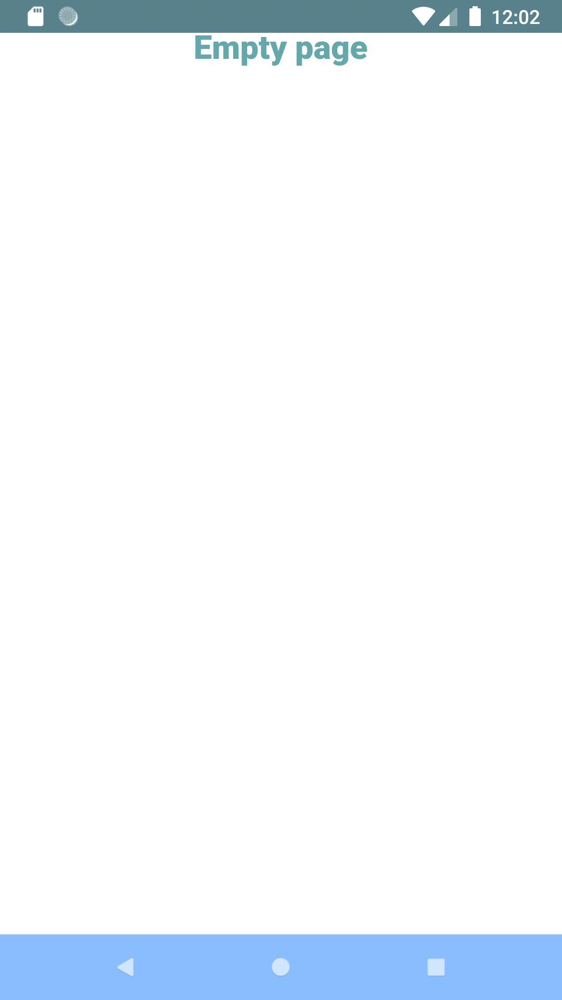
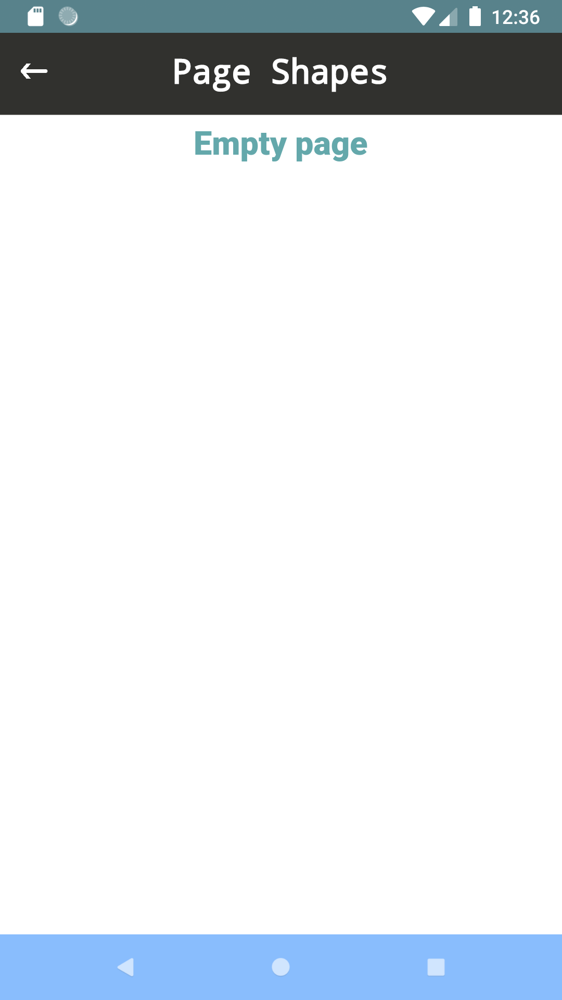

# Tutorial : Page Shapes

## Get Start 
### Full Example
1. Create New Widget extends "StatefulWidget" .
2. inside build() make return "PageTemplate.t()" .

```
import 'package:fastor_app_ui_widget/fastor_app_ui_widget.dart';
import 'package:flutter/material.dart';

class TutorialCreateFastorPage extends StatefulWidget {
  @override
  TutorialCreateFastorState createState() => TutorialCreateFastorState();
}

class TutorialCreateFastorState extends State<TutorialCreateFastorPage> {
  
  @override
  Widget build(BuildContext context) {
    return PageTemplate.t( this,
        content: getContent() );
  }
  
  Widget getContent() {
    return  TextTemplate.t( "Empty page" );
  }
  
}
```

## Empty Screen



```
@override
Widget build(BuildContext context) {
return PageTemplate.t( this,
content: getContent() );
}
```

## Toolbar Custom Shape

Create any shape of Toolbar you want in custome shape then put it at page template



```
  @override
  Widget build(BuildContext context) {
    return PageTemplate.t( this,
        toolbar: ToolbarSimpleFastor( context, "Page Shapes"),
        toolbar_height : 70,
        content: getContent() );
  }
```

* The Default height of toolbar is 70
* When the toolbar you draw different than 70 you can change by this parameter "toolbar_height"